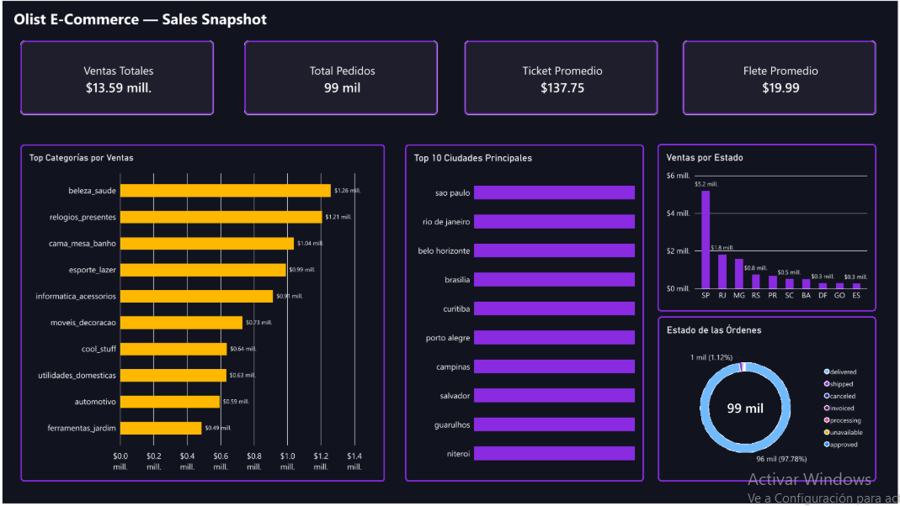

# 🛒 Olist E-Commerce — Sales & Operational Analytics



## 📌 Descripción del Proyecto
Este proyecto aborda la transformación y análisis end-to-end del dataset público de **Olist** (el e-commerce más grande de Brasil). El objetivo principal fue integrar 4 archivos transaccionales desconectados en un modelo relacional robusto dentro de **SQL Server** y desarrollar un dashboard ejecutivo interactivo en **Power BI** para monitorear el rendimiento comercial y logístico.

---

## 🛠️ Tecnologías y Herramientas Utilizadas
* **Base de Datos:** SQL Server (Modelado Relacional, Integridad Referencial, Vistas Analíticas, `JOINs`).
* **Visualización & Analítica:** Power BI (Modelo Dimensional, Medidas DAX, Análisis Top N, Inteligencia Temporal).
* **Diseño UI/UX:** Dark Mode personalizado con alto contraste (Morado/Mostaza) y tarjetas redondeadas enfocadas en legibilidad ejecutiva.

---

## 📐 Arquitectura del Pipeline de Datos

```text
[Archivos Crudos CSV] ➔ [SQL Server: Base Relacional + Vistas] ➔ [Power BI: Modelo & DAX] ➔ [Executive Dashboard]
